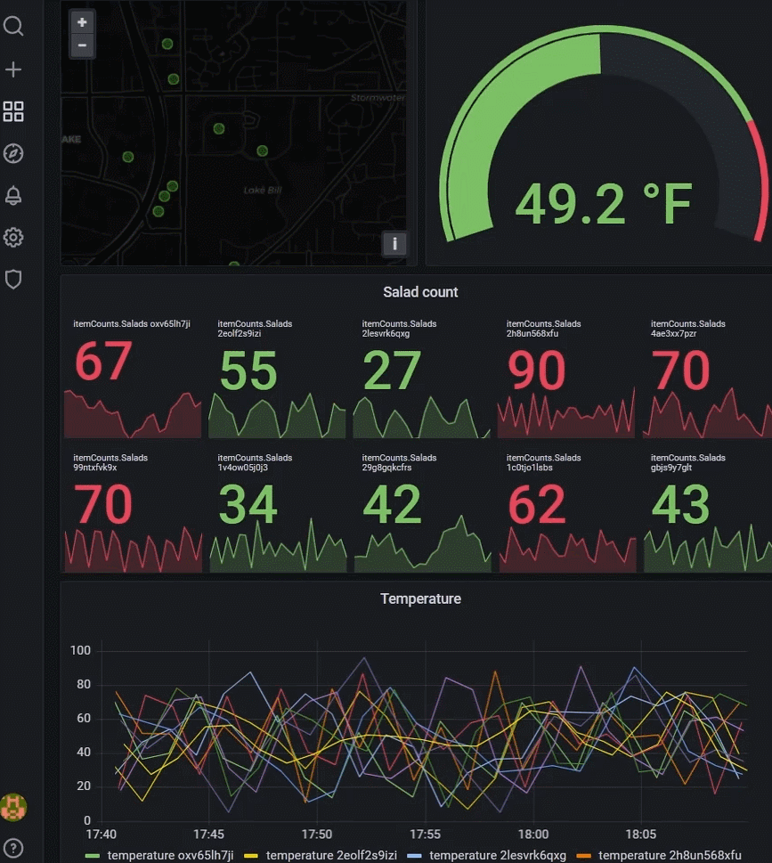
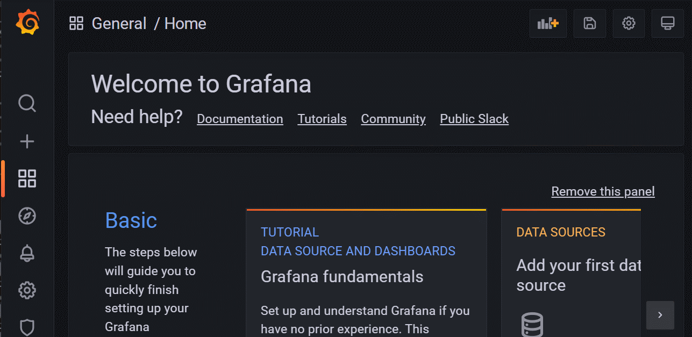
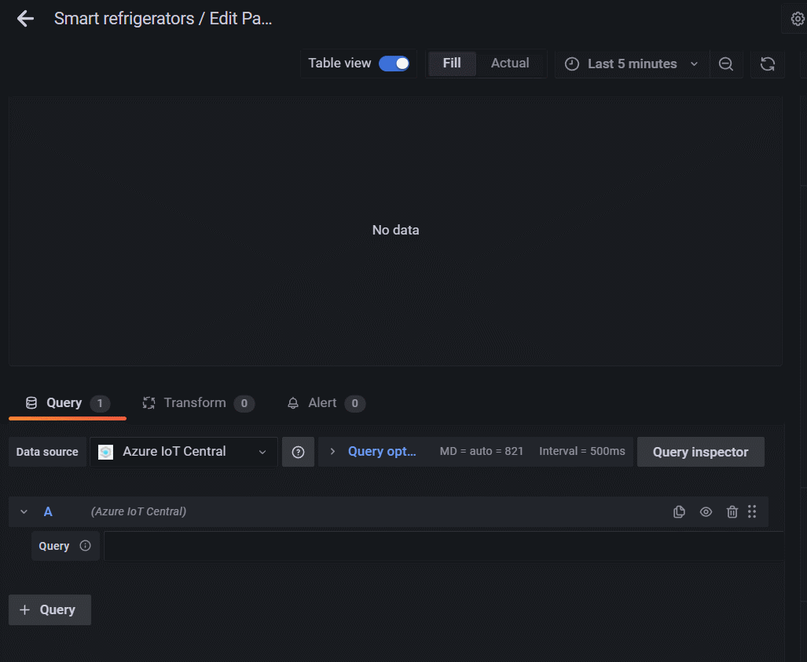
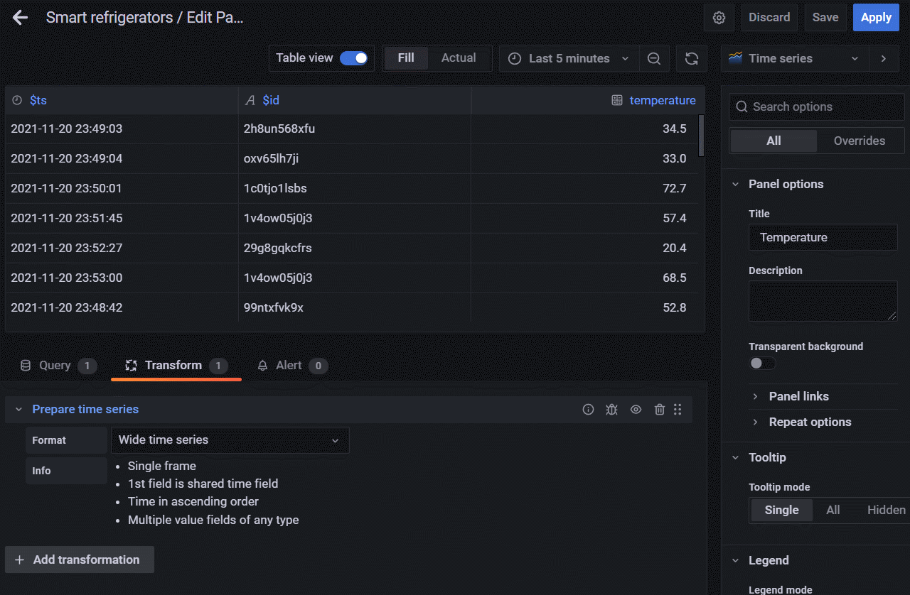

# Grafana data source plugin for Azure IoT Central
This sample plugin enables IoT Central as a Grafana data source. By leveraging the new [IoT Central query API](https://docs.microsoft.com/en-us/azure/iot-central/core/howto-query-with-rest-api), you can use Grafana dashboards to visualize and analyze your IoT data. 


## Setup instructions
1. Clone this repository in the local directory where you want Grafana to look for local plugins.
2. Set up Grafana to [load plugins from your local directory](https://grafana.com/tutorials/build-a-data-source-plugin/#set-up-your-environment).
3. Configure your Grafana installation to allow the IoT Central plugin to be [loaded as an unsigned plugin](https://grafana.com/docs/grafana/latest/plugins/plugin-signatures/#allow-unsigned-plugins).

```
allow_loading_unsigned_plugins = microsoft-azure-iot-central
```
4. In the plugin folder, run:
```
yarn install
yarn dev
```
5. Restart your Grafana server. The Azure IoT Central plugin should now be available under data sources:



6. Configure the data source with you IoT Central application URL and an API token. The application URL can be found under `Administration > Your application` (e.g, `<myapp>.azureiotcentral.com`). API tokens can be created in the `Administration > API tokens` section of you IoT Central application.

## Querying data
To start building dashboards with the newly added IoT Central data source, simply provide the desired query. The query syntax follows the [IoT Central query API](https://docs.microsoft.com/en-us/azure/iot-central/core/howto-query-with-rest-api).



### Time range
By default, the plugin will override the time window of your query with the time range configured in the dashboard.

### Timestamp field
If the timestamp field is being project, the plugin will automatically return it in the correct time format expected by Grafana. To convert other custom timestamp fields to the proper time format, use the `Convert field type` transformation available in the `Transform` tab.

### Time series
Query results are returned as a single data frame. To easily split the data into multiple series, use the `Prepare time series > Multi-frame time series` transformation available under the `Transformations` tab.



### Complex values
By default, the plugin will flatten any complex values returned in the query result set. For instance, if the query returns a field `location: { lat: 47.643567, lon: -122.129685}`, the result set will contain `location.lat: 47.643567` and `location.lon: -122.129685`.
